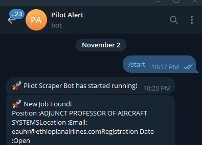
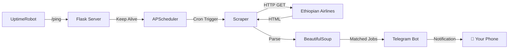

# ✈️ Ethiopian Airlines Pilot Job Scraper

<div align="center">


**An automated job monitoring system that scrapes Ethiopian Airlines' careers page and sends instant Telegram notifications when pilot positions become available.**

[Features](#-features) • [Quick Start](#-quick-start) • [Deployment](#-deployment) • [Configuration](#%EF%B8%8F-configuration) • [Architecture](#-architecture)

</div>

---

## 🎯 Overview

Never miss a pilot opportunity again. This lightweight Python service continuously monitors Ethiopian Airlines' job portal and instantly alerts you via Telegram when matching positions are posted.

```
============================================================
🛫  ETHIOPIAN AIRLINES JOB SCRAPER
============================================================
  📅 Time     : 2024-12-07 09:00:00
  🔗 Source   : https://corporate.ethiopianairlines.com/...
------------------------------------------------------------
  🚀 Scraper started...
  ✅ Page fetched successfully
  🔍 Found 100 links to scan
  📬 Notification sent:
  ──────────────────────────────────────────────────
  📌 PILOT TRAINEE - AB INITIO PROGRAM
  ──────────────────────────────────────────────────
------------------------------------------------------------
  📊 Summary: 1 matching jobs out of 100 links
============================================================
```

---

## ✨ Features

| Feature | Description |
|---------|-------------|
| 🔄 **Automated Scheduling** | Runs on configurable cron schedule (Sun, Mon, Wed, Fri at 9:00 AM) |
| 📱 **Instant Notifications** | Real-time Telegram alerts when jobs are found |
| 🌐 **Cloud Ready** | Deploys seamlessly to Render, Railway, or any cloud platform |
| 🏥 **Health Monitoring** | Built-in `/ping` and `/health` endpoints for uptime monitoring |
| 🎨 **Professional Output** | Clean, formatted console output for easy monitoring |
| 🔒 **Secure** | Environment-based configuration, no hardcoded secrets |

---

## 🚀 Quick Start

### Prerequisites

- Python 3.9+
- Telegram Bot Token (from [@BotFather](https://t.me/BotFather))
- Your Telegram Chat ID

### Installation

```bash
# Clone the repository
git clone https://github.com/ispastro/pilot_ping.git
cd pilot_ping

# Create virtual environment
python -m venv venv

# Activate virtual environment
# Windows:
.\venv\Scripts\Activate.ps1
# Linux/Mac:
source venv/bin/activate

# Install dependencies
pip install -r requirements.txt
```

### Configuration

Create a `.env` file in the project root:

```env
BOT_TOKEN=your_telegram_bot_token_here
CHAT_ID=your_telegram_chat_id_here
```

<details>
<summary>📖 How to get your Chat ID</summary>

1. Start a chat with your bot on Telegram
2. Send any message to the bot
3. Run the helper script:
   ```bash
   python get_chat_id.py
   ```
4. Copy the `chat_id` from the output

</details>

### Run Locally

```bash
# Single run (test)
python scrapper.py

# With scheduler (production)
python scheduler.py

# Web server mode (for cloud deployment)
python app.py
```

---

## ☁️ Deployment

### Deploy to Render (Recommended)

1. **Push to GitHub**
   ```bash
   git add .
   git commit -m "Initial deployment"
   git push origin main
   ```

2. **Create Render Web Service**
   - Go to [render.com](https://render.com)
   - Click **New** → **Web Service**
   - Connect your GitHub repository
   - Configure:
     | Setting | Value |
     |---------|-------|
     | **Build Command** | `pip install -r requirements.txt` |
     | **Start Command** | `gunicorn app:app` |

3. **Add Environment Variables**
   - Go to **Environment** tab
   - Add `BOT_TOKEN` and `CHAT_ID`

4. **Set Up Uptime Monitoring** (Prevent spin-down)
   - Go to [uptimerobot.com](https://uptimerobot.com)
   - Create HTTP monitor for `https://your-app.onrender.com/ping`
   - Set interval to 5 minutes

### Health Check Endpoints

| Endpoint | Response | Purpose |
|----------|----------|---------|
| `/` | Service status JSON | Main health check |
| `/ping` | `{"status": "ok"}` | Simple ping for uptime monitors |
| `/health` | `{"status": "healthy"}` | Kubernetes-style health probe |

---

## 🗂️ Project Structure

```
pilot_ping/
├── app.py              # Flask web server with health endpoints
├── scrapper.py         # Core scraping logic
├── bot.py              # Telegram bot wrapper
├── scheduler.py        # APScheduler cron configuration
├── get_chat_id.py      # Helper to retrieve Telegram chat ID
├── requirements.txt    # Python dependencies
├── Procfile            # Render/Heroku deployment config
├── .env                # Environment variables (not in repo)
├── .gitignore          # Git ignore rules
└── README.md           # You are here
```

---

## ⚙️ Configuration

### Schedule Customization

Edit `app.py` to modify the scraping schedule:

```python
# Current: Sun, Mon, Wed, Fri at 9:00 AM
scheduler.add_job(run_scraper, 'cron', 
    day_of_week='sun,mon,wed,fri', 
    hour=9, 
    minute=0
)

# Example: Every day at 8 AM and 5 PM
scheduler.add_job(run_scraper, 'cron', hour='8,17', minute=0)

# Example: Every 6 hours
scheduler.add_job(run_scraper, 'interval', hours=6)
```

### Keyword Customization

Edit `scrapper.py` to change job search keywords:

```python
# Current filter
if "pilot" in text_lower and "trainee" in text_lower:

# Add more keywords
keywords = ["pilot", "trainee", "cadet", "first officer", "captain"]
if any(kw in text_lower for kw in keywords):
```

---

## 🏗️ Architecture



---

## 🔧 Troubleshooting

<details>
<summary>❌ Bot not sending messages</summary>

1. Verify `BOT_TOKEN` is correct
2. Ensure you've started a chat with the bot first
3. Check `CHAT_ID` using `python get_chat_id.py`
4. For groups/channels, ensure bot has send message permissions

</details>

<details>
<summary>❌ 500 Error on Render</summary>

1. Check Render logs for detailed error
2. Verify environment variables are set
3. Ensure `scrapper.py` has `if __name__ == "__main__":` guard

</details>

<details>
<summary>❌ Service spinning down on Render</summary>

1. Set up [UptimeRobot](https://uptimerobot.com) to ping `/ping` every 5 minutes
2. This keeps the free tier service alive 24/7

</details>

---

## 🤝 Contributing

1. Fork the repository
2. Create a feature branch (`git checkout -b feature/amazing-feature`)
3. Commit your changes (`git commit -m 'Add amazing feature'`)
4. Push to the branch (`git push origin feature/amazing-feature`)
5. Open a Pull Request

---

## 📄 License

This project is licensed under the MIT License - see the [LICENSE](LICENSE) file for details.

---

## 🙏 Acknowledgments

- [Ethiopian Airlines](https://www.ethiopianairlines.com) for the career opportunities
- [python-telegram-bot](https://python-telegram-bot.org/) for the excellent Telegram library
- [APScheduler](https://apscheduler.readthedocs.io/) for reliable job scheduling

---

<div align="center">

**Built with ☕ and ambition**

⭐ Star this repo if it helped you land your dream pilot job!

</div>
